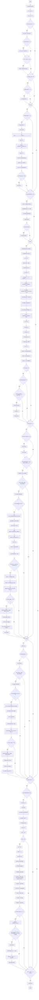

```mermaid
graph TD

S(start)-->16["16 global skip_flag"]
16-->17["17 e_num = 0"]
17-->18["18 c_num = 0"]
18-->19{"19 if line.find('#') > -1:"}
19-->|YES|20["20 c_num = line.find('#')"]
20-->21{"21 if line.rfind(''') > -1:"}
21-->|YES|22["22 e_num = line.rfind(''')"]
22-->23{"23 if e_num < c_num:"}
21-->|NO|23
23-->|YES|24["24 line = line[:line.find('#')]"]
24-->25{"25 if(skip_flag == 0):"}
23-->|NO|25
19-->|NO|25
25-->|YES|26{"26 if(line.find('''') > -1):"}
26-->|YES|27["27 skip_flag = 1"]
27-->28{"28 else:"}
26-->|NO|28
25-->|NO|28
28-->|YES|29{"29 if(line.find('''') > -1):"}
29-->|YES|30["30 skip_flag = 2"]
30-->31["31 return line"]
31-->34["34 print('――――――――function――――――――')"]
34-->35["35 cnt = 0"]
35-->36["36 file = open(path,'r',encoding='utf-8')"]
36-->38["38 cnt += 1"]
38-->39["39 line = line[:line.find('(')]"]
39-->40["40 line = com_skip(line)"]
40-->41["41 line = line.expandtabs()"]
41-->42{"42 if skip_flag == True:"}
42-->|YES|43["43 continue"]
43-->44{"44 if line.find('def ') == 0:"}
29-->|NO|44
28-->|NO|44
42-->|NO|44
44-->|YES|45["45 line = line[4:line.find('(')]"]
45-->46["46 print(str(cnt) + '\t' + line)"]
46-->47["47 funclist.append(line)"]
47-->48["48 file.close()"]
48-->49{"49 if len(funclist):"}
49-->|YES|50["50 print(funclist)"]
50-->51{"51 else:"}
44-->|NO|51
49-->|NO|51
51-->|YES|52["52 print('funclist is nothing')"]
52-->56["56 global flow_path_w"]
56-->57["57 cnt = 0"]
57-->58["58 det_flag = False"]
58-->59["59 call_funclist = []"]
59-->61["61 state = 0"]
61-->62["62 print('--------------flowdown-----------------')"]
62-->63["63 #file = open(path,'r',encoding = 'utf-8')"]
63-->64["64 outfile = open(flow_path_w,'w',encoding = 'utf-8')"]
64-->65["65 outfile.write('```mermaid\n')"]
65-->66["66 outfile.write('graph TD\n\n')"]
66-->67["67 outfile.write('S(start)-->')"]
67-->71["71 file = open(path,'r',encoding = 'utf-8')"]
71-->72["72 cnt = 0"]
72-->73["73 state = 0"]
73-->74["74 tabcnt = 0"]
74-->75["75 line_num = []"]
75-->76["76 pop_flag = False"]
76-->79["79 cnt += 1"]
79-->80["80 #line = line[:line.find('/n')]"]
80-->81["81 line = line.replace(''',''')"]
81-->82["82 line = com_skip(line)"]
82-->83{"83 if state == 0:"}
83-->|YES|84{"84 if(len(funclist) > 0):"}
84-->|YES|85{"85 if line.find('def ' + funclist[0]) > -1 :"}
85-->|YES|86["86 funclist.pop(0)"]
86-->87["87 state = 1"]
87-->88["88 continue"]
88-->89{"89 elif state == 1:"}
51-->|NO|89
85-->|NO|89
84-->|NO|89
83-->|NO|89
89-->|YES|90{"90 if (line.find('def ') == 0):"}
90-->|YES|92["92 continue"]
92-->95["95 continue"]
95-->96{"96 elif(line.find('if') > -1) or (line.find('else') > -1):"}
90-->|NO|96
96-->|YES|98["98 tabcnt = tab_cnt(line)"]
98-->100{"100 if (depth_list[0] > tab_cnt(line)):"}
100-->|YES|101["101 depth_list.pop(0)"]
101-->102{"102 if len(depth_line_list) > 0:"}
102-->|YES|103["103 line_num.append(depth_line_list[0])"]
103-->104["104 depth_line_list.pop(0)"]
104-->105["105 pop_flag = True"]
105-->108["108 depth_list.insert(0,tab_cnt(line)+1"]
108-->109["109 depth_line_list.insert(0,cnt"]
109-->112["112 ')+4:]"]
112-->113["113 line = line[:line.find('\n')]"]
113-->114["114 print(str(cnt)+' '+line)"]
114-->115{"115 print('==> if tabs cnt = '+str(tabcnt+1))"}
115-->|YES|116["116 print('==>'+str(depth_list))"]
116-->117["117 print('==>'+str(depth_line_list))"]
117-->118["118 outfile.write(str(cnt)+'{''+str(cnt)+' '+line+''}'+'\n')"]
118-->119{"119 if pop_flag == True:"}
119-->|YES|121["121 outfile.write(str(line_num[i])+'-->|NO|'+str(cnt)+'\n')"]
121-->122["122 pop_flag = False"]
122-->123["123 line_num.clear()"]
123-->124["124 outfile.write(str(cnt) + '-->|YES|')"]
124-->126["126 continue"]
126-->127{"127 else:"}
102-->|NO|127
100-->|NO|127
115-->|NO|127
119-->|NO|127
96-->|NO|127
127-->|YES|129["129 ')+4:]"]
129-->130{"130 if(len(cline) < 2 )"}
130-->|YES|131["131 continue"]
131-->133{"133 if (depth_list[0] > tab_cnt(line)):"}
133-->|YES|134["134 depth_list.pop(0)"]
134-->135{"135 if len(depth_line_list) > 0:"}
135-->|YES|136["136 line_num.append(depth_line_list[0])"]
136-->137["137 depth_line_list.pop(0)"]
137-->139["139 ')+4:line.find('\n')]"]
139-->140["140 print(str(cnt)+' '+line)"]
140-->141["141 outfile.write(str(cnt)+'[''+str(cnt)+' '+line+'']'+'\n')"]
141-->142{"142 if pop_flag == True:"}
142-->|YES|144["144 outfile.write(str(line_num[i])+'-->|NO|'+str(cnt)+'\n')"]
144-->145["145 pop_flag = False"]
145-->146["146 line_num.clear()"]
146-->147["147 outfile.write(str(cnt)+'-->'"]
147-->149{"149 elif state == 2:"}
135-->|NO|149
133-->|NO|149
130-->|NO|149
142-->|NO|149
127-->|NO|149
89-->|NO|149
149-->|YES|150{"150 if(line.find('def ')==0):"}
150-->|YES|151["151 state = 0"]
151-->152["152 break"]
152-->153["153 outfile.write('END[end]\n')"]
153-->154["154 outfile.write('```')"]
154-->155["155 outfile.close()"]
155-->158["158 cnt = 0"]
158-->159["159 ') == 0):"]
159-->160{"160 ') == 0):"}
160-->|YES|161["161 ')+4:]"]
161-->162["162 cnt += 1"]
162-->163["163 return cnt"]
163-->166["166 fnc_analyze(path)"]
166-->167["167 flowdown(path)"]
167-->170["170 print(os.getcwd())"]
170-->171["171 print('↓ please input path of folder including analyze source ')"]
171-->172["172 path = os.getcwd()"]
172-->174["174 file_list = os.listdir(path)"]
174-->175["175 cnt = len(file_list)"]
175-->177["177 line = file_list[i]"]
177-->178["178 path = os.getcwd()"]
178-->179{"179 if( line.find('.py') > -1 ):"}
179-->|YES|180["180 line = line[line.find('.py'):]"]
180-->181{"181 if len(line) != 3:#ファイル名の拡張子が'.py'でなければskip"}
181-->|YES|182["182 continue"]
182-->183["183 print('file_cnt =' + str(i))"]
183-->185["185 path = path + '//'  + file_list[i]"]
185-->186["186 analyze(path)"]
186-->188{"188 __name__ == '__main__':"}
150-->|NO|188
149-->|NO|188
160-->|NO|188
181-->|NO|188
179-->|NO|188
188-->|YES|189["189 main()"]
189-->END[end]
```