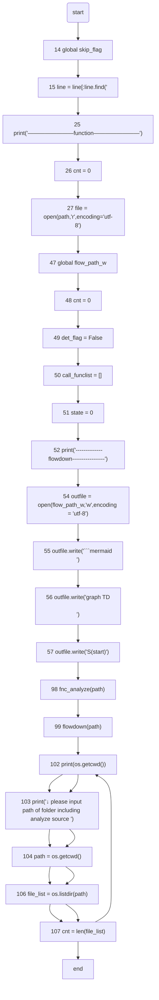

```mermaid
graph TD

S(start)-->14["14 global skip_flag"]
14-->15["15 line = line[:line.find('"]
15-->25["25 print('――――――――function――――――――')"]
25-->26["26 cnt = 0"]
26-->27["27 file = open(path,'r',encoding='utf-8')"]
27-->47["47 global flow_path_w"]
47-->48["48 cnt = 0"]
48-->49["49 det_flag = False"]
49-->50["50 call_funclist = []"]
50-->51["51 state = 0 "]
51-->52["52 print('--------------flowdown-----------------')"]
52-->54["54 outfile = open(flow_path_w,'w',encoding = 'utf-8')"]
54-->55["55 outfile.write('```mermaid\n')"]
55-->56["56 outfile.write('graph TD\n\n')"]
56-->57["57 outfile.write('S(start)')"]
57-->98["98 fnc_analyze(path)"]
98-->99["99 flowdown(path)"]
99-->102["102 print(os.getcwd())"]
102-->103["103 print('↓ please input path of folder including analyze source ')"]
103-->104["104 path = os.getcwd()"]
104-->106["106 file_list = os.listdir(path)"]
106-->107["107 cnt = len(file_list)"]
107-->102["102 print(os.getcwd())"]
102-->103["103 print('↓ please input path of folder including analyze source ')"]
103-->104["104 path = os.getcwd()"]
104-->106["106 file_list = os.listdir(path)"]
106-->107["107 cnt = len(file_list)"]
107-->END[end]
```